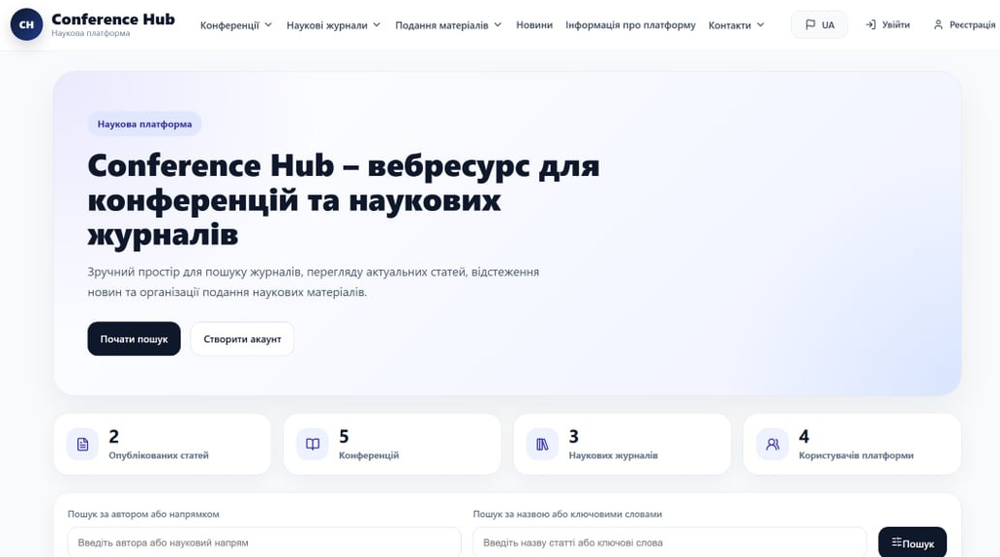
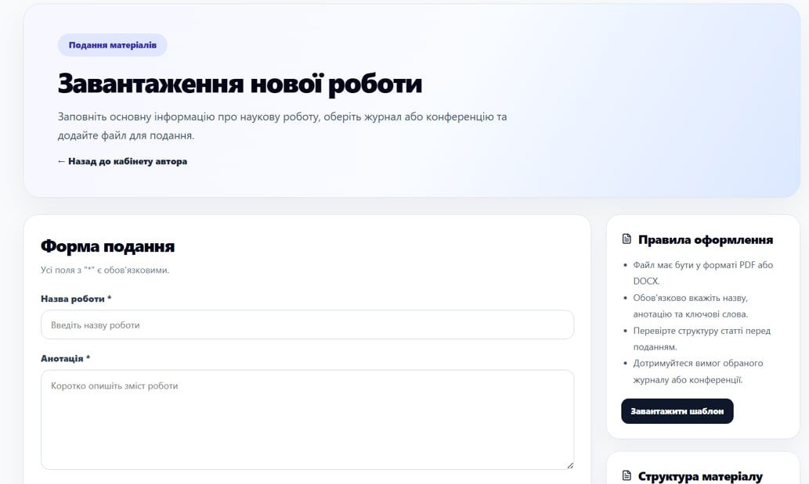

<hr>

# Conference Hub

## Project Description

**Conference Hub** is a full-stack web application designed to support the organization and management of scientific conferences and journals. The main goal of the project is to provide a convenient platform for submitting scientific papers, managing the peer-review process, and making decisions on submitted materials.

The system supports different user roles, including **Authors, Reviewers, and Organizing Committee members**, with functionality tailored to each role.

## Technologies

### Backend
- **Runtime:** Node.js
- **Framework:** Express.js
- **Language:** TypeScript
- **Database:** PostgreSQL
- **ORM:** Prisma
- **Authentication:** JWT
- **Email Service:** Nodemailer

### Frontend
- **Library:** React
- **Language:** TypeScript
- **Build Tool:** Vite
- **Styling:** CSS / SCSS

## Features

- User registration and authentication
- Role-based access control
- Management of scientific conferences and journals
- Submission of scientific papers
- Uploading PDF files and submission-related materials
- Adding paper metadata, including title, abstract, keywords, and co-authors
- Assignment of reviewers to submitted papers
- Blind peer-review process
- Submission of reviews and recommendations
- Tracking submission and review statuses
- Final decision-making by the Organizing Committee
- Email notifications
- Management of users and conference-related data

## User Roles

### Author

Authors can:
- Browse available conferences and journals
- Submit scientific papers
- Provide paper metadata and upload files
- Add co-authors
- Track the status of their submissions
- View final decisions on submitted papers

### Reviewer

Reviewers can:
- View papers assigned to them
- Review submitted scientific materials
- Provide comments and evaluations
- Submit recommendations to the Organizing Committee

### Organizing Committee

Committee members can:
- Manage conferences and journals
- View submitted papers
- Assign reviewers
- Monitor the peer-review process
- Review submitted evaluations
- Make final decisions on papers

## Current Status

The project is functional and implements the main workflow for managing scientific conferences and journals, including paper submission, peer review, and decision-making.

Possible future improvements include:
- Further UI/UX improvements
- Extended administrative functionality
- Advanced statistics and analytics
- Additional notification options
- Further automated and integration testing

## Screenshots

Below are some screenshots demonstrating the main features and interface of Conference Hub.

<p align="center">
  
  
</p>

## Installation and Setup

1. Clone the repository:

   ```bash
   git clone https://github.com/h3llcore/conference-hub.git
   ```
2. Navigate to the project directory:

   ```bash
   cd conference-hub
   ```

3. Install dependencies:

   ```bash
   npm install
   ```

4. Configure the required environment variables.

5. Generate the Prisma Client:

   ```bash
   npx prisma generate
   ```

6. Apply database migrations:

   ```bash
   npx prisma migrate dev
   ```

7. Start the Backend server:

   ```bash
   npm run dev
   ```

8. Start the Frontend development server:

   ```bash
   npm run dev
   ```

## Purpose

Conference Hub was developed to automate and simplify the processes associated with scientific conferences and journals. It provides a centralized environment where authors can submit their research, reviewers can evaluate papers, and organizing committees can efficiently manage the entire review and decision-making workflow.

## Contact

If you have any questions or suggestions, please contact me at: h3llcore.work@gmail.com

<hr>
